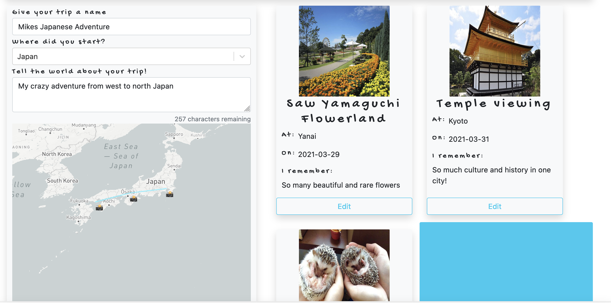

# Project 3

## Overview

Project 3 was a one-week team coded project with [Duncan Browne](https://github.com/DBBrowne) and [Alex Chan](https://github.com/Achan81). We worked using a single Git repository for the first time. We wanted to create an app all about travel. Users would be able to create trips, and within that trip users can add individual memories of special events that took place. Trips could be discoverable by country and editable at any time.

## The Brief
The brief was to build and deploy the fullstack of a MERN app using React for the frontend and Node.js for the backend.

## Built with

- HTML
- CSS
- Bootstrap
- JavaScript
- React.js
- MongoDB
- Mongoose
- Axios
- Git
- GitHub
- MapBox

## Deployment

You can view the deployed app [here](https://theplacebook.netlify.app/).

## Process

## Planning
We began by creating two plans on a Miro board, one for the back end models and endpoints that we wanted to create. The other for the frontend pages and components that we wanted to use. We planned to have the backend basically functioning by the start of day 3. By this point on the front end we wanted to have all of the core pages running and able to send the HTTP requests that they needed. 

We planned to work fairly closely together on Zoom for this - having standups each morning to talk about how the aspects we were working on are going, and talking about any issues we had found or future parts of the projects we had concerns about. This became very important towards the end of the project when we had to prioritise which stretch goals we were going to aim for and what functionality we thought was most important. 

## Building the backend

We decided to work on three separate areas at the start. I worked on building the models and basic functionality of the backend, Alex began working on implementing a design theme across the site and Duncan worked on integrating the maps into the site.

There are four models in our backend: country, memory, trip and users. Using Mongoose’s relationships, we were able to reference the other models and populate these fields when needed. This would be especially useful in creating our trip/memory relationship.

My first challenge was ensuring that the user model could make use of virtual fields so that the password confirmation would work on registering, and that all incoming passwords were hashed. For this, we used JWT for authorisation and bcrypt to make sure that passwords are never stored as plain text.

As this was a user-centric approach, a secure route was added so that certain parts of the website could only be accessed by people with an account, and also allowed us to show unique information based on the user.

We created a RESTful app and used controllers to define the requests that each model needed to be able to handle. We also ensured that there was custom error handling built into the backend to ensure a better UX.

## Front End
 
The key features on the front end are;
- Registering and logging in
- Trips
- Memories
- Countries view
- The maps

### Registering and Logging in

I took charge of the functionality of this and Alex handled the styling. Both forms are controlled through state and will error if the requirements aren’t met. This ensures that the backend only receives usable data. Once a user logs in, the nav bar changes what it displays and allows for users to access more features as well as offering a logout option. The logout function is achieved by just deleting the token that was given to them on logging in.

### Creating a trip/memory

This page was led by Duncan and is made up of a memory create and a trip create component on one page. Once the user selects ‘create trip’, it automatically sends the post request with a default name, the page they are then shown becomes a put request for that trip. Any memories added on the right hand side of that trip are added to the trip. Here users are also allowed to upload a photo for each trip which we achieved using the Cloudinary app

### The Maps

We wanted to have a map that would chart the users’ memories across a trip. The initial plan was to use the Google Maps API, which we had to abandon. Gaining meaningful access to it in the time frame wouldn’t have been practical. Instead we used MapBox. This was not without its own challenges - on initial deployment of this project, we found that the version we had caused a page to crash and so we had to revert back to an earlier version of MapBox.

The challenges I took on with maps was the user search box, accessing the longitude and latitude properties and passing them to the form. This proved very tricky, and for a while all of the memories would revert back to null island.

This was eventually solved as below and the map adds data directly into the form. If there are multiple memories, these show as a polyline on the trip’s main map.

### Inspiration / Countries section

I led this as a show page for the countries and as a way for other users’ trips to be presented. We scraped some Data from the REST Countries API and that gave us the language, code and current for each country. The description at the top was pulled from Wikipedia. We initially wanted to do all 206 countries, but decided that this was a poor use of time.

If a country has trips that include that country, they are shown as cards underneath the country. If there are no trips to that country, then a placeholder card is shown that takes the user directly to create a trip for that country.

Because of this feature, we now needed to add a countries select list to the trip forms so that the countries would always have a usable location.

## Finished Snap Shots

## Challenges Encountered

We were very ambitious in this challenge and met some significant challenges along the way. Making the maps behave the way we wanted and moving data between the maps and the forms was the biggest challenge we faced. We also found the image uploading using Cloudinary very challenging at first, and incorporating React Select with the data set we wanted meant we had to find a work around for the countries data. This was our first time using Git as a team so we had to ensure that our work was kept consistently clean and that we were in regular communication about the data we were pushing. 

## Wins
- The maps function as we intended and we were very proud of getting over that hurdle
- The design is sleek and functions on mobile
- Working together as a team with a diverse set of backgrounds and technical preferences

## Known bugs
- If a user doesn’t enter a valid location on the map it defaults to null island
- Map sizing on the ‘see trips’ page has overspilled and is too wide
- The profile view does not currently work in the deployed environment

## Future Improvements
- Ability for users to favourite trips
- A dream trips function
- Trips become searchable